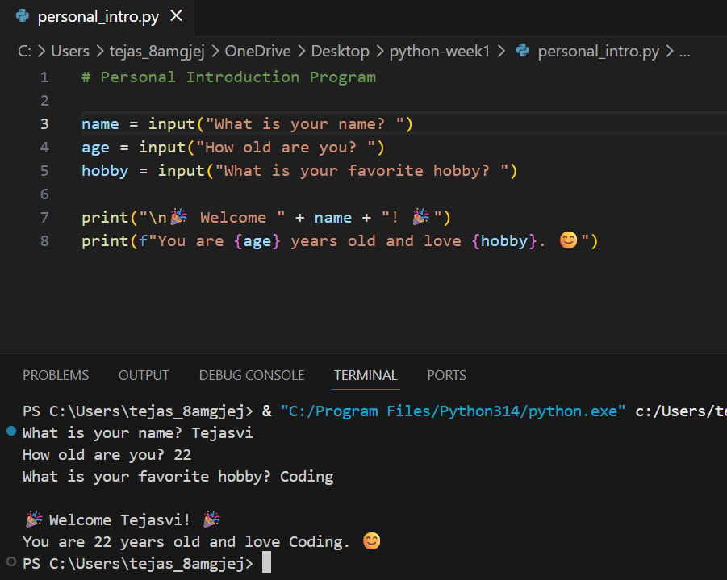

# Personal Introduction Program

## 📌 Project Overview
This is a beginner Python program that takes user input (name, age, hobby) and displays a personalized welcome message.

## 🎯 Objectives
- Learn Python basics
- Practice input/output
- Understand variables and strings

## ⚙️ Setup Instructions
1. Install Python
2. Open terminal
3. Run:
   python personal_intro.py

## 🧠 What I Learned
- Using input() for user input
- Storing data in variables
- Displaying output using print()
- Using f-strings

## 📸 Screenshot
()